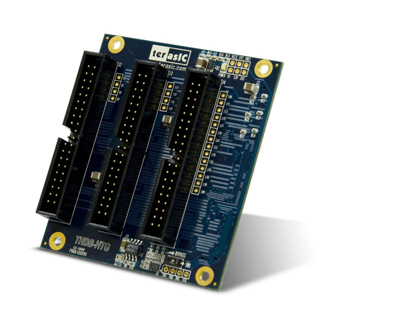
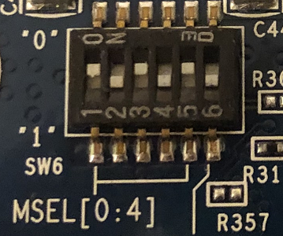
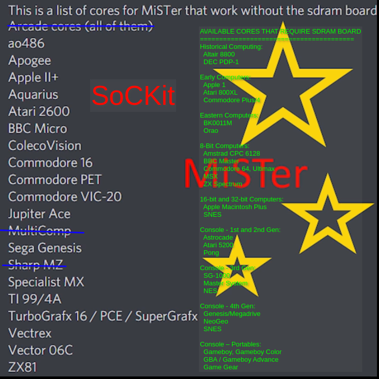
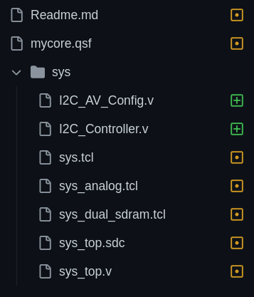

# SoCkit FPGA MiSTer compatible platform

Find here information about converting your SoCkit FPGA board into a MiSTer compatible platform with the latest firmware and framework.

Some of the information below is taken from [ModernHackers](https://github.com/MiSTer-Arrow-SoCKit/Main_MiSTer/wiki ) so we acknowledge and thanks them for his previous work on porting the MiSTer framework and cores to SoCkit. 


Arrow SoCKit FPGA is a rich hardware to run MiSTer cores. Without HSMC-GPIO adapter you cannot attach SDRAM modules, so it is is better to invest into. If you do not have HMSC-GPPIO addon board, you can run those cores that not requiring SDRAM, for example Genesis.

This port leverages all built-in hardware capabilities of the board:

* VGA Output
* Audio output
* USB Connector

All ported and tested cores for Arrow SoCKit are listed at [SoCkitfpga repositories](https://github.com/orgs/sockitfpga/repositories) tagged with `mister` topic


HSMC-GPIO male addon board (P0033 reference from [Terasic](https://www.terasic.com.tw/cgi-bin/page/archive.pl?Language=English&CategoryNo=67&No=322&PartNo=2#heading))

Arrow SoCKit port of MiSTer scales original video resolution to a standard VGA resolution (usually 1280x720p60), so you don't need to look for some ancient low HZ monitor (you will have to enable scaler mode in MiSTer.ini).

## How does it work?

### **1. You need to set the dip switches on the board to the following position:**

You can find the dip switches on the bottom-left corner:


Zoomed dip switch status:



If you miss this step your board is not able to boot-up from the SD card and not able to load the menu.rbf file and your video output will be blank.

### **2. Slide Switches to down position**

You need to set to down position all slide switches:


Also notice that for the GPIO addon SDRAM expansion the jumper needs to be in the 3V3 last position.

### **3. Micro SD card for the project**

#### Linux script to build a MiSTer SD card for Arrow SoCkit FPGA (latest MiSTer firmware)

Adapted from https://github.com/michaelshmitty/SD-Installer-macos_MiSTer

* Execute the script [MiSTer-sd-installer-linux.sh](MiSTer-sd-installer-linux.sh) to build the MiSTer SD card
* Copy this recommended [MiSTer.ini](MiSTer.ini) to the root folder of SD card
  * vga scaler mode set in order to see picture on a standard VGA monitor 
  * modify volumectl if the sound volume is too high and it causes audio distortion for the audio chip on Arrow SoC-Kit.


See [old_firmware/](old_firmware/) folder for ModernHackers port (old firmware/framework).


### **4. Download the wished SoCkit compatible cores and copy to the SD card partition**

Find the latest rbf binaries of the cores in https://github.com/sockitfpga/SoCKit_binaries.

All ported and tested cores for Arrow SoCKit are listed at [SoCkitfpga repositories](https://github.com/orgs/sockitfpga/repositories) tagged with `mister` topic

For example try this template core [mycore.rbf](mycore.rbf)


## SoCkit Switches / Buttons / Leds

**Switches:** 

* Default position is all switches pointing towards outside the board
  * 0 means switch position towards outside of the board
  * 1 means switch position towards inside of the board

- SW0: Audio pins output selection
  - 0 Audio Sigma-Delta and SPDIF pins output 
  - 1 I2S output though the  sigma delta and SPDIF audio pins 
- SW1: 
  - 0  MIDI I2S input enabled. All User IO pins enabled for input. 
  - 1  three User IO pins are disabled as inputs.
- SW2: Not used.
- SW3: Switch has no effect in SoCkit. Internally is wired to 0 in the cores as it is necessary for VGA output mode.
  - SW3=1 is used in DE10-nano for MiSTer dual SDRAM mode and disables functions of analog IO board (VGA, SD card, Sigma/Delta audio, SPDIF audio, Leds)

**Keys:**

- KEY 0 = OSD   button  (brings OSD to screen)
- KEY 1 = USER  button (usually is the own core's reset button)

- KEY 4 = RESET button (FPGA reset brings menu.rbf again to screen)

**Leds:**

-  LED 0 = USER led

- LED 1 = HDD led

- LED 2 = POWER led

- LED 3 = LOCKED led


## SoCkit HSMC GPIO addon assignments

* [HSMC_GPIO_pinout_assignments.md](HSMC_GPIO_pinout_assignments.md).


## Using MiSTer SDRAM modules

* Read ModernHackers blog: http://modernhackers.com/128mb-sdram-board-on-de10-standard-de1-soc-and-arrow-sockit-fpga-sdram-riser/


#### List of cores working with and without (Cyclone V)  SDRAM expansion (ported by ModernHackers) [might not work with the latest MiSTer firmware]:




## Porting cores to SoCkit

Check this [COMMIT](https://github.com/sockitfpga/Template_SoCkit/commit/c349aa28e03251e3225126e6f79496f1b9eeb9d7) changes.    This [guide](Portando_a_SoCkit.md) is available in Spanish .

Core template with all the latest changes needed for Sockit: https://github.com/sockitfpga/Template_SoCkit

New files (green) and changed files (orange):




## Guia para portar cores de MiSTer a SoCkit

*  [Guía de portado de cores MiSTer a SoCkit](Portando_a_SoCkit.md).

  

## Pasos en GitHub para portar un core

- Busco el core a portar en  https://github.com/orgs/MiSTer-devel/repositories 

- Forkeo el core de MiSTer desde la web del repopisotorio en mi GitHub personal

- Clono el fork en mi ordenador: `git clone ssh://url`   

- Borro los rbf de la carpeta releases (dejo el resto de ficheros como rom y mra)

- Porto el core según el último commit de Template. 

  - Personalmente uso el programa Meld para comparar todos los ficheros del core Template versus los del core a portar

- Modifico el archivo README.md del core

- Sintetizo en Quartus y testeo el rbf

- Pongo el rbf en la carpeta releases/  con la fecha de creación (ejemplo core_20220702.rbf)

- Cierro Quartus y limpio los ficheros inútiles que genera Quartus con el script clean.bat / clean.sh

- Subo a GitHub:

  ```sh
  #antes de subir a GitHub comprobar los archivos que han cambiado y las diferencias
  git status
  git diff
  #subir archivos
  git add .
  git commit -am "Sockit port"
  git push
  ```

  

### ModernHackers useful links regarding the old MiSTer port:

* Main MiSTer port site https://github.com/MiSTer-Arrow-SoCKit/Main_MiSTer/wiki 
* Mister SDRAM expansion http://modernhackers.com/128mb-sdram-board-on-de10-standard-de1-soc-and-arrow-sockit-fpga-sdram-riser/

* Info about the port http://modernhackers.com/porting-mister-to-arrow-sockit-fpga/

* Comparison of ported cores between platforms http://modernhackers.com/mister/
